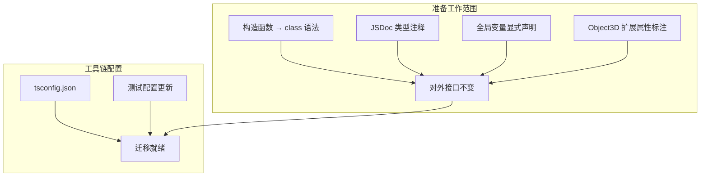

# 设计文档：JS → TS 迁移前准备工作

## 概述

本设计文档描述 `plugin/` 目录（约 45 个 JS 文件）在正式迁移到 TypeScript 之前需要完成的准备工作。核心目标是：消除隐式类型依赖、统一语法风格、配置好工具链，使后续迁移可以逐文件、低风险地进行。

所有工作在纯 JavaScript 环境下完成，不引入 `.ts` 文件，不引入构建工具。

### 设计决策

1. **class 转换策略**：对 20 个使用 constructor function 的文件统一转换为 ES6 class 语法。对于 `MetaLoader` 和 `VerseLoader` 中大量使用 `const self = this` 的方法，转换为 class 方法并使用箭头函数回调替代 `self` 引用。
2. **JSDoc 策略**：使用 `import('three')` 语法引用 three.js 类型，使用 `{object}` 描述 editor 实例（因为 editor 是动态 monkey-patch 的，没有固定类型定义）。
3. **全局变量处理**：对于 `Factory.js` 等未 import THREE 但在运行时使用全局 THREE 的文件，添加 `/* global THREE */` 注释和 JSDoc 类型声明。对于 `EditorPatches.js` 中使用的 `signals.Signal`，同样添加全局声明注释。
4. **tsconfig 策略**：`checkJs: false` 初始阶段不强制检查，`noEmit: true` 仅做类型检查不生成输出，`paths` 映射 `'three'` bare specifier。

## 架构

本准备工作不改变系统架构，仅对现有代码进行语法层面的现代化和类型注释补充。



### 文件分类

| 类别 | 文件数 | 说明 |
|------|--------|------|
| 需要转换 class 的文件 | 20 | MetaLoader, VerseLoader, EditorLoader, 10 Sidebar.*.js, 7 Menubar.*.js |
| 已经是 class 语法的文件 | ~25 | Factory, MetaFactory, ComponentContainer, CommandContainer, EventContainer, Access, 各 Component/Command 类等 |
| 使用全局 THREE 的文件 | ~20 | Factory.js, Sidebar.Events.js, Sidebar.Animation.js, Sidebar.ObjectExt.js 等 |
| 使用全局 signals 的文件 | 1 | EditorPatches.js |

## 组件与接口

### 1. 构造函数转 class（需求 1）

需要转换的 20 个文件分为三类模式：

**模式 A：复杂构造函数 + `self = this`（MetaLoader, VerseLoader）**

```javascript
// 转换前
function MetaLoader(editor) {
    this.json = null;
    const self = this;
    this.save = async function() { self.getMeta(); };
    editor.signals.upload.add(function() { self.save(); });
}

// 转换后
class MetaLoader {
    constructor(editor) {
        this.json = null;
        this.editor = editor;
        editor.signals.upload.add(() => { this.save(); });
    }
    async save() { this.getMeta(); }
}
```

关键点：
- `const self = this` 模式通过箭头函数回调消除
- 信号回调 `editor.signals.xxx.add(function() { self.xxx(); })` 改为 `editor.signals.xxx.add(() => { this.xxx(); })`
- 内部方法从 `this.xxx = function()` 提升为 class 方法
- `editor` 引用保存为 `this.editor`（MetaLoader/VerseLoader 构造函数内部大量使用 `editor` 局部变量，需要改为 `this.editor`）

**模式 B：简单构造函数（EditorLoader）**

```javascript
// 转换前
function EditorLoader(editor) {
    const creater = new SceneCreater(editor);
    this.load = function(input) { ... };
}

// 转换后
class EditorLoader {
    constructor(editor) {
        this.creater = new SceneCreater(editor);
    }
    load(input) { ... }
}
```

**模式 C：UI 构造函数返回对象（10 Sidebar + 7 Menubar 文件）**

```javascript
// 转换前
function SidebarCommand(editor) {
    const container = new UIPanel();
    function update() { ... }
    return { container, update };
}

// 转换后 — 保持函数形式但确保无 `new` 调用模式
// 注意：这些文件虽然是 function 形式，但它们不是通过 `new` 调用的构造函数，
// 而是工厂函数，返回 { container, update } 对象。
// 需要确认调用方式后决定是否需要转换。
```

经过代码分析，Sidebar.*.js 和 Menubar.*.js 文件中的函数（如 `SidebarCommand`、`MenubarCommand`）虽然首字母大写，但实际上是**工厂函数**，不通过 `new` 调用，返回 `{ container, update }` 或 `container` 对象。这些不属于需求 1 中定义的 "Constructor_Function"（通过 `new` 调用的普通函数）。

但部分 Menubar 文件（如 `MenubarEntity`、`MenubarGoto`）直接返回 `container`，调用方式需要确认。根据 three.js editor 的惯例，这些都是工厂函数。

**实际需要转换的构造函数文件（3 个）：**
- `plugin/mrpp/MetaLoader.js` — 通过 `new MetaLoader(editor)` 调用
- `plugin/mrpp/VerseLoader.js` — 通过 `new VerseLoader(editor)` 调用
- `plugin/mrpp/EditorLoader.js` — 通过 `new EditorLoader(editor)` 调用

**Sidebar/Menubar 工厂函数（17 个）：**
虽然不是严格的 Constructor_Function，但需求 1.1 要求 "不包含任何使用 `function Foo(args) { this.xxx = ... }` 模式"。这些工厂函数中部分使用了 `this` 吗？经检查，Sidebar/Menubar 工厂函数**不使用 `this`**，它们使用闭包变量。因此它们不匹配需求 1.1 的模式，不需要转换。

但需求 1.5 说 "IF Plugin_Layer 中存在其他使用 Constructor_Function 模式的文件"。需要确认是否有其他文件使用 `function Foo() { this.xxx = ... }` 模式。经过全面搜索，只有 MetaLoader、VerseLoader、EditorLoader 三个文件使用此模式。

### 2. JSDoc 类型注释（需求 2）

注释策略：

```javascript
/**
 * @param {object} editor - Editor 实例
 * @param {import('three').Scene} scene - 场景对象
 * @returns {Promise<object>} 序列化后的场景数据
 */
async write(scene) { ... }
```

需要添加 JSDoc 的文件优先级：
1. MetaLoader.js、VerseLoader.js（需求 2.5、2.6）
2. Factory.js、MetaFactory.js、ComponentContainer.js、CommandContainer.js、EventContainer.js（需求 2.7）
3. Access.js（需求 2.8）
4. 其他所有 class 文件的 constructor 和 public 方法（需求 2.1、2.2）

### 3. 全局变量声明（需求 3）

**使用全局 THREE 但未 import 的文件：**

| 文件 | THREE 用法 |
|------|-----------|
| `Factory.js` | `THREE.MathUtils.degToRad`, `THREE.Matrix4`, `THREE.Euler` |
| `Sidebar.Events.js` | `THREE.MathUtils.generateUUID()` |
| `Sidebar.Animation.js` | `THREE.AnimationClip` |
| `Sidebar.ObjectExt.js` | `THREE.Vector3`, `THREE.Euler`, `THREE.MathUtils` |
| `Sidebar.Blockly.js` | 需确认 |
| `Sidebar.Meta.js` | 需确认 |
| `Sidebar.MultipleObjects.js` | 需确认 |
| `Sidebar.Screenshot.js` | 需确认 |
| `Sidebar.Text.js` | 需确认 |
| `Sidebar.Media.js` | 需确认 |

处理方式：在文件顶部添加全局声明注释：
```javascript
/* global THREE */
/** @type {typeof import('three')} */
// eslint-disable-next-line no-unused-vars -- THREE is loaded via import map in the HTML host
```

**使用全局 signals 的文件：**
- `EditorPatches.js` — 使用 `signals.Signal`

处理方式：
```javascript
/* global signals */
// signals 库通过 <script> 标签加载为全局变量，提供 signals.Signal 构造函数
```

### 4. Object3D 扩展属性标注（需求 4）

三个扩展属性需要标注：

```javascript
/**
 * MRPP 扩展属性：组件数组，附加在 THREE.Object3D 实例上。
 * 不属于 three.js 原生类型定义，迁移时需要声明扩展类型。
 * @type {Array<{type: string, [key: string]: any}>}
 */
node.components = data.children.components || [];

/**
 * MRPP 扩展属性：命令数组，附加在 THREE.Object3D 实例上。
 * @type {Array<{type: string, [key: string]: any}>}
 */
node.commands = data.children.commands || [];

/**
 * MRPP 扩展属性：事件对象，附加在 THREE.Scene 实例上。
 * @type {{inputs: Array<{title: string, uuid: string}>, outputs: Array<{title: string, uuid: string}>}}
 */
scene.events = { inputs: [], outputs: [] };
```

### 5. tsconfig.json 配置（需求 5）

```jsonc
{
  // === 基础配置 ===
  "compilerOptions": {
    // 允许 TS 编译器处理 .js 文件（渐进式迁移的关键）
    "allowJs": true,
    // 初始阶段不对 .js 文件强制类型检查（迁移完成后改为 true）
    "checkJs": false,
    // 启用严格模式（迁移后的 .ts 文件立即受益）
    "strict": true,
    // 目标 ES2022，匹配浏览器原生 ES modules 环境
    "target": "ES2022",
    // ESNext 模块系统
    "module": "ESNext",
    // bundler 模块解析（支持 bare specifier）
    "moduleResolution": "bundler",
    // 仅做类型检查，不生成输出文件（保持无构建工具约束）
    "noEmit": true,
    // 映射 'three' bare specifier 到实际路径
    "paths": {
      "three": ["./three.js/build/three.module.js"]
    },
    // 基础路径
    "baseUrl": "."
  },
  // 将 plugin/ 纳入编译范围
  "include": ["plugin/**/*"],
  // 排除测试和 node_modules
  "exclude": ["node_modules", "three.js/editor/test/node_modules"]
}
```

### 6. 测试配置更新（需求 6）

**vitest.config.js 更新：**
- `include` 增加 `**/*.test.ts` 和 `**/*.spec.ts`
- `coverage.include` 增加 `plugin/**/*.ts`

**package.json 更新：**
- 添加 `typescript: "^5.0.0"` 到 devDependencies

**eslint.config.js 更新：**
- 增加 `plugin/**/*.ts` 的规则配置
- 使用 `@typescript-eslint` 解析器
- 启用 `@typescript-eslint/no-explicit-any` 规则（warn 级别）

### 7. no-typescript 测试更新（需求 7）

将 `no-typescript.test.js` 重命名为 `typescript-migration.test.js`，包含：
- 迁移前状态测试（当前通过）：验证 plugin/ 中不存在 .ts 文件
- 迁移后状态测试（`describe.skip`）：验证 plugin/ 中存在 .ts 文件

## 数据模型

本准备工作不引入新的数据模型。涉及的现有数据结构：

### Object3D 扩展属性类型

```typescript
// 迁移时需要创建的类型声明（本阶段仅通过 JSDoc 标注）
interface MrppObject3DExtensions {
    components: Array<{ type: string; [key: string]: any }>;
    commands: Array<{ type: string; [key: string]: any }>;
}

interface MrppSceneExtensions {
    events: {
        inputs: Array<{ title: string; uuid: string }>;
        outputs: Array<{ title: string; uuid: string }>;
    };
}
```

### Editor 实例扩展属性

```typescript
// editor 实例通过 EditorPatches.js monkey-patch 添加的属性
interface MrppEditorExtensions {
    type: string;
    resources: any[];
    selectedObjects: any[];
    access: Access;
    multiSelectGroup: any;
    data: any;
    metaLoader?: MetaLoader;
    verseLoader?: VerseLoader;
    // 自定义信号
    signals: {
        upload: Signal;
        release: Signal;
        // ... 其他自定义信号
    };
    // 自定义方法
    save(): boolean;
    showNotification(message: string, isError?: boolean): void;
    showConfirmation(message: string, onConfirm: Function, onCancel: Function | null, event: Event, isError?: boolean): void;
    getSelectedObjects(): any[];
    clearSelection(): void;
}
```


## 正确性属性（Correctness Properties）

*属性（property）是指在系统所有合法执行中都应成立的特征或行为——本质上是对系统应做什么的形式化陈述。属性是人类可读规格说明与机器可验证正确性保证之间的桥梁。*

### Property 1: 无构造函数模式

*For any* JavaScript 文件 in `plugin/`，该文件不应包含使用 `function Foo(args) { this.xxx = ... }` 模式定义的构造函数（即不存在通过 `new` 调用的、内部使用 `this` 赋值的普通函数）。

**Validates: Requirements 1.1, 1.5**

### Property 2: 无 self = this 模式

*For any* JavaScript 文件 in `plugin/`，该文件不应包含 `const self = this` 或 `var self = this` 模式。

**Validates: Requirements 1.4**

### Property 3: 类方法 JSDoc 覆盖

*For any* class 定义 in `plugin/` 中的 JavaScript 文件，其 constructor 方法（如有参数）应包含 `@param` JSDoc 注释，其 public 方法（如有参数）应包含 `@param` 注释，如有返回值应包含 `@returns` 注释。

**Validates: Requirements 2.1, 2.2, 2.5, 2.6, 2.7, 2.8**

### Property 4: 全局 THREE 声明完整性

*For any* JavaScript 文件 in `plugin/`，如果该文件在运行时使用了 `THREE.` 但没有 `import * as THREE from 'three'` 语句，则该文件顶部应包含 `/* global THREE */` 或等效的全局变量声明注释。

**Validates: Requirements 3.1, 3.3**

### Property 5: 无 import/全局 THREE 混用

*For any* JavaScript 文件 in `plugin/`，该文件不应同时存在 `import * as THREE from 'three'` 和全局 THREE 声明注释。即：每个文件要么通过 import 使用 THREE，要么通过全局声明使用 THREE，不能混用。

**Validates: Requirements 3.4**

### Property 6: 导出接口不变

*For any* JavaScript 文件 in `plugin/`，准备工作完成后该文件的 `export` 名称集合应与准备工作开始前完全一致。

**Validates: Requirements 8.5**

## 错误处理

本准备工作主要是代码重构和配置变更，不涉及新的运行时错误处理逻辑。

关键风险点及缓解措施：

1. **class 转换破坏 `this` 绑定**：MetaLoader/VerseLoader 中大量使用 `const self = this` + 普通函数回调。转换为 class 方法后，信号回调必须使用箭头函数以保持正确的 `this` 绑定。缓解：每个转换后的文件都需要通过现有属性测试验证。

2. **全局 THREE 声明遗漏**：如果某个文件使用全局 THREE 但未添加声明注释，后续 TypeScript 迁移时会出现 `THREE is not defined` 错误。缓解：Property 4 通过属性测试自动检测。

3. **tsconfig paths 解析失败**：`'three'` bare specifier 的 paths 映射可能因路径错误导致 tsc 报模块解析错误。缓解：需求 5.5 要求 `tsc --noEmit` 不产生配置相关错误。

4. **测试配置更新破坏现有测试**：eslint 或 vitest 配置变更可能意外影响现有测试。缓解：需求 8 要求所有 4 个属性测试在准备工作完成后继续通过。

## 测试策略

### 双重测试方法

本 spec 采用单元测试 + 属性测试的双重测试方法：

- **属性测试（Property-Based Testing）**：使用 `fast-check` 库验证跨所有文件的通用属性（如 "所有文件无构造函数模式"）。每个属性测试至少运行 100 次迭代。
- **单元测试**：验证特定文件的具体行为（如 MetaLoader 的接口完整性、tsconfig.json 的配置正确性）。

### 属性测试配置

- 库：`fast-check`（已在 devDependencies 中）
- 框架：`vitest`
- 最小迭代次数：100
- 每个属性测试必须通过注释引用设计文档中的属性编号
- 标签格式：`Feature: js-to-ts-migration-prep, Property {number}: {property_text}`

### 属性测试实现

每个正确性属性对应一个属性测试：

| 属性 | 测试方法 | 生成器 |
|------|---------|--------|
| Property 1: 无构造函数模式 | 随机采样 plugin/ 文件，正则检测 `function Foo(` + `this.` 模式 | `fc.integer` 索引到文件列表 |
| Property 2: 无 self = this | 随机采样 plugin/ 文件，正则检测 `const self = this` | `fc.integer` 索引到文件列表 |
| Property 3: 类方法 JSDoc 覆盖 | 随机采样 class 方法，检测 JSDoc 注释存在 | `fc.integer` 索引到方法列表 |
| Property 4: 全局 THREE 声明 | 随机采样使用 THREE 的文件，验证 import 或全局声明存在 | `fc.integer` 索引到文件列表 |
| Property 5: 无混用 | 随机采样文件，验证不同时存在 import 和全局声明 | `fc.integer` 索引到文件列表 |
| Property 6: 导出接口不变 | 随机采样文件，比较 export 名称与基线快照 | `fc.integer` 索引到文件列表 |

### 单元测试

- MetaLoader 接口完整性：验证转换后的 class 包含所有指定方法
- VerseLoader 接口完整性：同上
- tsconfig.json 配置验证：验证必需字段存在且值正确
- 测试配置验证：验证 vitest/eslint/package.json 更新正确

### 现有属性测试

4 个现有属性测试必须在所有准备工作完成后继续通过：
1. `import-paths.test.js` — 所有 import 路径指向存在的文件
2. `i18n-completeness.test.js` — 所有 MRPP 字符串在所有语言中存在
3. `three-reference.test.js` — plugin/ 中的 three.js 引用使用 bare specifier
4. `typescript-migration.test.js`（原 `no-typescript.test.js`）— plugin/ 中不存在 .ts 文件
