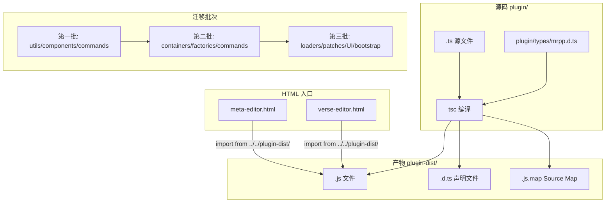
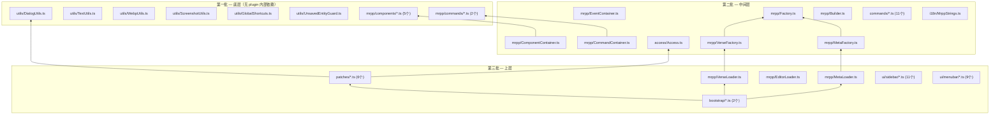
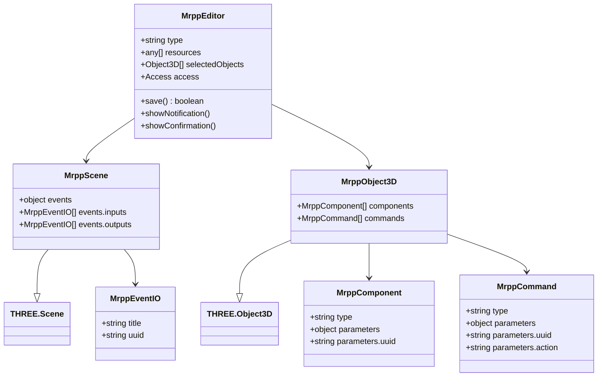

# 设计文档：plugin/ 目录 JS → TS 实际迁移

## 概述

本设计文档描述将 `plugin/` 目录中约 45 个 JavaScript 文件迁移为 TypeScript 文件的完整技术方案。前置准备工作（`js-to-ts-migration-prep` spec）已完成，包括：构造函数转 class 语法、JSDoc 类型注释、全局变量显式声明、tsconfig.json 基础配置。

### 核心策略

- **转译工具**：纯 `tsc`（TypeScript 编译器），不引入 esbuild/webpack/vite
- **输出目录**：`plugin-dist/`，保持与 `plugin/` 1:1 目录结构
- **Import 路径**：`.ts` 源文件中保持 `.js` 后缀（tsc `moduleResolution: "bundler"` 自动解析）
- **HTML 入口**：指向 `plugin-dist/`（编译产物）
- **分批迁移**：底层 → 中间层 → 上层，按依赖层级推进

### 设计决策

1. **为什么用 tsc 而非 esbuild/vite？** 项目使用浏览器原生 ES modules + import map，无需打包。tsc 直接输出 ES module `.js` 文件，保持 1:1 文件映射，与现有架构完全兼容。
2. **为什么 import 路径保持 `.js` 后缀？** tsc 在 `moduleResolution: "bundler"` 模式下，源码中 `import './foo.js'` 会解析到 `./foo.ts`，编译产物中路径保持 `.js` 不变，浏览器加载时自然正确。这避免了运行时路径不匹配的问题。
3. **为什么输出到 `plugin-dist/` 而非原地编译？** 保持源码（`.ts`）和产物（`.js`）分离，便于 `.gitignore` 管理，避免源码目录混乱。
4. **共享类型定义文件策略**：创建 `plugin/types/mrpp.d.ts`，集中定义 `MrppEditor`、`MrppObject3D`、`MrppScene` 等接口，以及全局变量声明（`THREE`、`signals`）。避免每个文件重复声明。

## 架构



### 迁移批次依赖关系



## 组件与接口

### 1. tsconfig.json 更新（需求 1）

当前 tsconfig.json 配置 `noEmit: true`，需要调整为编译输出模式：

```jsonc
{
  "compilerOptions": {
    "allowJs": true,           // 迁移过程中 .js/.ts 共存
    "checkJs": false,          // 不检查未迁移的 .js 文件
    "strict": true,            // 严格模式
    "target": "ES2022",
    "module": "ESNext",
    "moduleResolution": "bundler",
    "noEmit": false,           // 改为 false，启用编译输出
    "outDir": "plugin-dist",   // 输出目录
    "rootDir": "plugin",       // 源码根目录
    "declaration": true,       // 生成 .d.ts
    "sourceMap": true,         // 生成 .js.map
    "paths": {
      "three": ["./three.js/build/three.module.js"]
    },
    "baseUrl": "."
  },
  "include": ["plugin/**/*"],
  "exclude": ["node_modules", "three.js/editor/test/node_modules"]
}
```

关键变更：
- `noEmit: false` + `outDir: "plugin-dist"` + `rootDir: "plugin"` — 启用编译输出
- `declaration: true` — 生成类型声明文件
- `sourceMap: true` — 生成 source map 用于调试

### 2. 共享类型定义文件（需求 2）

创建 `plugin/types/mrpp.d.ts`，集中定义跨文件共享的类型：

```typescript
import * as THREE from 'three';

// ── Object3D 扩展属性 ──
export interface MrppComponent {
  type: string;
  parameters: { uuid: string; [key: string]: any };
}

export interface MrppCommand {
  type: string;
  parameters: { uuid: string; action: string; [key: string]: any };
}

export interface MrppEventIO {
  title: string;
  uuid: string;
}

export interface MrppObject3D extends THREE.Object3D {
  components: MrppComponent[];
  commands: MrppCommand[];
}

export interface MrppScene extends THREE.Scene {
  events: { inputs: MrppEventIO[]; outputs: MrppEventIO[] };
}

// ── Editor 扩展接口 ──
export interface MrppEditor {
  type: string;
  resources: any[];
  selectedObjects: any[];
  access: import('../access/Access.js').Access;
  multiSelectGroup: any;
  data: any;
  metaLoader?: any;
  verseLoader?: any;
  scene: MrppScene;
  camera: THREE.Camera;
  selected: THREE.Object3D | null;
  config: { getKey(key: string): any; setKey(key: string, value: any): void };
  signals: Record<string, any>;
  strings: { getKey(key: string): string };
  selector: { select(object: THREE.Object3D): void };
  renderer: THREE.WebGLRenderer;
  // 方法
  save(): boolean;
  showNotification(message: string, isError?: boolean): void;
  showConfirmation(message: string, onConfirm: Function, onCancel: Function | null, event: Event, isError?: boolean): void;
  getSelectedObjects(): THREE.Object3D[];
  clearSelection(): void;
  execute(command: any): void;
  addObject(object: THREE.Object3D, parent?: THREE.Object3D, index?: number): void;
  removeObject(object: THREE.Object3D): void;
  select(object: THREE.Object3D | null, multiSelect?: boolean): void;
  clear(): void;
  setScene(scene: THREE.Scene): void;
  fromJSON(json: any): Promise<void>;
  toJSON(): any;
  storage: { init(cb: Function): void; get(cb: Function): void; set(data: any): void; clear(): void };
  loader: { loadItemList(items: any): void; loadFiles(files: any): void };
  [key: string]: any;
}

// ── 全局变量声明 ──
declare global {
  // signals 库通过 <script> 标签加载
  const signals: {
    Signal: new () => { add(listener: Function): void; dispatch(...args: any[]): void; remove(listener: Function): void };
  };
  // 部分文件通过全局 THREE 访问（未 import）
  // 迁移后这些文件应改为 import，此声明作为过渡
  var THREE: typeof import('three');
  interface Window {
    editor: MrppEditor;
    resources: Map<string, any>;
  }
}
```

### 3. 单文件迁移模式

每个文件的迁移遵循统一模式：

1. 重命名 `.js` → `.ts`
2. 将 JSDoc `@param`/`@returns` 转换为 TypeScript 原生类型标注
3. 移除 `/* global THREE */` 和 JSDoc 全局声明注释（使用 `mrpp.d.ts` 中的全局声明）
4. 对 Object3D 扩展属性使用类型断言：`(object as MrppObject3D).components`
5. 确保 `tsc --noEmit` 通过

示例（ActionComponent）：

```typescript
// 迁移前 (.js)
/** @param {object} editor - Editor 实例 */
constructor(editor, object, component) { ... }

// 迁移后 (.ts)
import type { MrppEditor, MrppComponent } from '../../types/mrpp.js';
constructor(editor: MrppEditor, object: THREE.Object3D, component: MrppComponent) { ... }
```

### 4. HTML 入口更新（需求 1.5, 6.4）

`meta-editor.html` 和 `verse-editor.html` 中的 bootstrap import 路径更新：

```html
<!-- 迁移前 -->
import { initMetaEditor } from '../../plugin/bootstrap/meta-bootstrap.js';

<!-- 迁移后 -->
import { initMetaEditor } from '../../plugin-dist/bootstrap/meta-bootstrap.js';
```

### 5. 构建脚本（需求 1.6）

在项目根目录的 `package.json`（如不存在则创建）中添加：

```json
{
  "scripts": {
    "build": "tsc -p tsconfig.json",
    "typecheck": "tsc --noEmit -p tsconfig.json"
  }
}
```

### 6. Git/Docker 配置（需求 1.7, 1.8, 1.9）

- `.gitignore` 添加 `plugin-dist/`
- `.dockerignore` 不排除 `plugin-dist/`（当前 `.dockerignore` 未列出 `plugin-dist/`，无需修改）
- Dockerfile 无需修改（CI/CD 先 `npm run build`，再 `docker build`）


## 数据模型

### 类型定义层次



### 文件迁移清单

| 批次 | 目录 | 文件数 | 文件列表 |
|------|------|--------|----------|
| 第一批 | plugin/utils/ | 6 | DialogUtils, TextUtils, WebpUtils, ScreenshotUtils, GlobalShortcuts, UnsavedEntityGuard |
| 第一批 | plugin/mrpp/components/ | 5 | ActionComponent, MovedComponent, RotateComponent, TooltipComponent, TriggerComponent |
| 第一批 | plugin/mrpp/commands/ | 2 | GestureCommand, VoiceCommand |
| 第二批 | plugin/mrpp/ | 4 | ComponentContainer, CommandContainer, EventContainer, Builder |
| 第二批 | plugin/mrpp/ | 3 | Factory, MetaFactory, VerseFactory |
| 第二批 | plugin/commands/ | 11 | AddCommandCommand, AddComponentCommand, AddEventCommand, RemoveCommandCommand, RemoveComponentCommand, RemoveEventCommand, SetCommandValueCommand, SetComponentValueCommand, SetEventValueCommand, MoveMultipleObjectsCommand, MultiTransformCommand |
| 第二批 | plugin/access/ | 1 | Access |
| 第二批 | plugin/i18n/ | 1 | MrppStrings |
| 第三批 | plugin/mrpp/ | 3 | MetaLoader, VerseLoader, EditorLoader |
| 第三批 | plugin/patches/ | 6 | EditorPatches, LoaderPatches, MenubarPatches, SidebarPatches, UIThreePatches, ViewportPatches |
| 第三批 | plugin/ui/sidebar/ | 11 | Sidebar.Animation, Sidebar.Blockly, Sidebar.Command, Sidebar.Component, Sidebar.Events, Sidebar.Media, Sidebar.Meta, Sidebar.MultipleObjects, Sidebar.ObjectExt, Sidebar.Screenshot, Sidebar.Text |
| 第三批 | plugin/ui/menubar/ | 9 | Menubar.Command, Menubar.Component, Menubar.Entity, Menubar.Goto, Menubar.MrppAdd, Menubar.MrppEdit, Menubar.Replace, Menubar.Scene, Menubar.Screenshot |
| 第三批 | plugin/bootstrap/ | 2 | meta-bootstrap, verse-bootstrap |

**总计：约 64 个文件**（含 `plugin/types/mrpp.d.ts` 类型定义文件）


## 正确性属性（Correctness Properties）

*属性（property）是指在系统所有合法执行中都应成立的特征或行为——本质上是对系统应做什么的形式化陈述。属性是人类可读规格说明与机器可验证正确性保证之间的桥梁。*

### Property 1: 所有迁移目标文件均为 .ts

*For any* 文件在迁移目标清单中（约 45 个文件），该文件应以 `.ts` 扩展名存在于 `plugin/` 目录中，且对应的 `.js` 原文件不再存在。

**Validates: Requirements 3.1, 3.2, 3.3, 4.1, 4.2, 4.3, 4.4, 4.5, 5.1, 5.2, 5.3, 5.4**

### Property 2: plugin-dist/ 镜像 plugin/ 目录结构

*For any* `.ts` 文件在 `plugin/` 目录中，`tsc` 编译后在 `plugin-dist/` 中应存在对应的 `.js` 文件，且相对路径一致（即 `plugin/mrpp/MetaLoader.ts` → `plugin-dist/mrpp/MetaLoader.js`）。

**Validates: Requirements 1.4**

### Property 3: 所有 .ts 文件的 import 路径使用 .js 后缀

*For any* `.ts` 文件在 `plugin/` 目录中，其所有相对 import 路径（以 `./` 或 `../` 开头）应以 `.js` 后缀结尾，不使用 `.ts` 后缀。

**Validates: Requirements 4.6, 6.1**

### Property 4: 导出接口名称不变

*For any* 迁移后的 `.ts` 文件在 `plugin/` 目录中，其 `export` 的名称集合应与迁移前的 `.js` 文件完全一致。

**Validates: Requirements 3.6**

### Property 5: 无遗留全局声明注释

*For any* `.ts` 文件在 `plugin/` 目录中，该文件不应包含 `/* global THREE */` 或 `/* global signals */` 注释（迁移后应使用 `mrpp.d.ts` 中的全局类型声明）。

**Validates: Requirements 5.6, 5.7**

### Property 6: 无 @ts-ignore 或 @ts-expect-error

*For any* `.ts` 文件在 `plugin/` 目录中，该文件不应包含 `@ts-ignore` 或 `@ts-expect-error` 注释（除非有明确的技术原因并附带说明）。

**Validates: Requirements 7.4**

### Property 7: three.js/editor/js/ 目录未被修改

*For any* 文件在 `three.js/editor/js/` 目录中，迁移过程不应修改该文件（不应出现 `.ts` 文件，不应改变现有 `.js` 文件内容）。

**Validates: Requirements 10.4**

## 错误处理

### 迁移过程中的风险与缓解

1. **类型错误导致编译失败**：迁移文件时可能遇到 `strict: true` 下的类型错误。缓解：对与 three.js editor 动态 API 交互的地方允许使用 `any`（附带注释说明原因），对 JSON 数据解析结果使用 `unknown` + 类型守卫。

2. **Import 路径断裂**：重命名 `.js` → `.ts` 后，其他文件的 import 可能找不到模块。缓解：tsc `moduleResolution: "bundler"` 模式下，`import './foo.js'` 会自动解析到 `./foo.ts`，无需修改引用方的 import 路径。

3. **全局变量类型不匹配**：`mrpp.d.ts` 中的全局声明可能与实际运行时不一致。缓解：全局声明仅作为过渡方案，迁移完成后应逐步将全局 THREE 引用改为 `import * as THREE from 'three'`。

4. **编译产物路径错误**：`plugin-dist/` 中的文件路径可能与 HTML 入口的 import 路径不匹配。缓解：`rootDir: "plugin"` 确保输出目录结构与源码一致，Property 2 通过属性测试验证。

5. **现有属性测试失败**：迁移过程中现有 4 个属性测试可能因文件扩展名变化而失败。缓解：每个批次完成后更新测试以支持 `.ts` 和 `.js` 混合状态，最终批次完成后切换到纯 `.ts` 模式。

## 测试策略

### 双重测试方法

本 spec 采用单元测试 + 属性测试的双重测试方法：

- **属性测试（Property-Based Testing）**：使用 `fast-check` 库验证跨所有文件的通用属性。每个属性测试至少运行 100 次迭代。
- **单元测试**：验证特定配置文件的具体值、特定文件的存在性等。

### 属性测试配置

- 库：`fast-check`（已在 `three.js/editor/test/package.json` 的 devDependencies 中）
- 框架：`vitest`
- 最小迭代次数：100
- 每个属性测试必须通过注释引用设计文档中的属性编号
- 标签格式：`Feature: js-to-ts-migration, Property {number}: {property_text}`
- 每个正确性属性由一个属性测试实现

### 属性测试实现

| 属性 | 测试方法 | 生成器 |
|------|---------|--------|
| Property 1: 所有迁移目标文件均为 .ts | 随机采样迁移目标清单，检查 .ts 文件存在且 .js 不存在 | `fc.integer` 索引到文件清单 |
| Property 2: plugin-dist/ 镜像结构 | 随机采样 plugin/ 中的 .ts 文件，检查 plugin-dist/ 中对应 .js 存在 | `fc.integer` 索引到 .ts 文件列表 |
| Property 3: import 路径 .js 后缀 | 随机采样 .ts 文件中的 import 语句，检查路径以 .js 结尾 | `fc.integer` 索引到 import 条目列表 |
| Property 4: 导出接口名称不变 | 随机采样 .ts 文件，比较 export 名称与基线快照 | `fc.integer` 索引到文件列表 |
| Property 5: 无遗留全局声明 | 随机采样 .ts 文件，检查不含 `/* global */` 注释 | `fc.integer` 索引到 .ts 文件列表 |
| Property 6: 无 @ts-ignore | 随机采样 .ts 文件，检查不含 `@ts-ignore` 或 `@ts-expect-error` | `fc.integer` 索引到 .ts 文件列表 |
| Property 7: editor/js/ 未修改 | 随机采样 three.js/editor/js/ 文件，检查无 .ts 文件 | `fc.integer` 索引到文件列表 |

### 单元测试

- tsconfig.json 配置验证：检查 `noEmit: false`、`outDir`、`declaration`、`sourceMap` 等值
- HTML 入口路径验证：检查 `meta-editor.html` 和 `verse-editor.html` 的 import 路径指向 `plugin-dist/`
- 类型定义文件验证：检查 `plugin/types/mrpp.d.ts` 存在且包含 `MrppEditor`、`MrppObject3D`、`MrppScene` 接口
- `.gitignore` 验证：检查包含 `plugin-dist/`

### 现有属性测试更新

4 个现有属性测试需要在迁移完成后更新：

1. **import-paths.test.js** — 更新 `collectJsFiles` 函数以同时收集 `.ts` 文件，更新 import 路径解析逻辑以支持 `.ts` → `.js` 映射
2. **i18n-completeness.test.js** — 更新 `MrppStrings.js` 路径为 `MrppStrings.ts`（或使用 glob 匹配）
3. **three-reference.test.js** — 更新文件收集函数以扫描 `.ts` 文件
4. **typescript-migration.test.js** — 启用"迁移后状态"测试，移除/跳过"迁移前状态"测试
