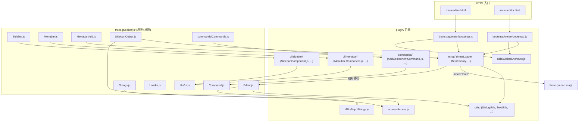

# 技术设计文档：MRPP 业务代码与 Three.js Editor 结构分离

## 概述

本设计文档描述如何将 GDGeek Editor 中所有 MRPP 自定义业务代码从 `three.js/editor/js/` 目录迁移到独立的 `plugin/` 目录。重构的核心原则是：**只做文件搬迁和路径更新，不改变任何运行时行为**。

重构涉及约 40 个自定义 JavaScript 文件的迁移、所有受影响 import 路径的更新、i18n 字符串的提取、HTML 入口文件内联逻辑的模块化，以及原版文件中侵入式修改的注释标记。

关键约束：
- 所有文件保持 JavaScript，不做 TypeScript 迁移
- 保持 three.js r140 版本不变
- 不引入 Vite、Webpack 等构建工具
- 不引入 npm 包管理器
- 保持现有 ES Module + import map 方式
- `server.js` 无需修改即可服务 `plugin/` 目录
- 功能表现与重构前完全一致

## 架构

### 重构前后目录对比

```
重构前:                              重构后:
three.js/editor/js/                  three.js/editor/js/
├── mrpp/  (业务逻辑)                ├── (原版文件，含 MRPP 标记注释)
├── utils/ (工具函数)                │
├── Access.js                        plugin/
├── Sidebar.Component.js             ├── mrpp/          (核心业务逻辑)
├── Sidebar.Command.js               ├── utils/         (工具函数)
├── Menubar.Component.js             ├── access/        (权限模块)
├── commands/Add*Command.js          ├── ui/sidebar/    (自定义 Sidebar)
│   ...                              ├── ui/menubar/    (自定义 Menubar)
meta-editor.html (含内联逻辑)        ├── commands/      (自定义 undo/redo)
verse-editor.html (含内联逻辑)       ├── i18n/          (MRPP 国际化字符串)
                                     └── bootstrap/     (HTML 入口初始化逻辑)
```

### 模块依赖关系



### 路径关系说明

从 `plugin/` 目录中的文件引用 `three.js/editor/js/` 中的原版文件时，使用相对路径。以 `plugin/mrpp/MetaFactory.js` 为例：

```
plugin/mrpp/MetaFactory.js
  → import 'three'                                    (通过 import map，不变)
  → import { Factory } from './Factory.js'             (plugin 内部引用)
  → import { createTextMesh } from '../utils/TextUtils.js'  (plugin 内部引用)
  → import { GLTFLoader } from '../../three.js/examples/jsm/loaders/GLTFLoader.js'  (引用 three.js 库)
```

从 `three.js/editor/js/` 中的原版文件引用 `plugin/` 中的文件时：

```
three.js/editor/js/Editor.js
  → import { DialogUtils } from '../../../plugin/utils/DialogUtils.js'
  → import { Access } from '../../../plugin/access/Access.js'

three.js/editor/js/Sidebar.js
  → import { SidebarComponent } from '../../../plugin/ui/sidebar/Sidebar.Component.js'
```

## 组件与接口

### 1. plugin/mrpp/ — 核心业务逻辑

迁移自 `three.js/editor/js/mrpp/`，保持内部结构不变。

| 文件 | 说明 | 主要依赖 |
|------|------|----------|
| Factory.js | 工厂基类 | three (import map) |
| MetaFactory.js | Meta 编辑器工厂 | Factory.js, three, GLTFLoader, DRACOLoader, VOXLoader, KTX2Loader, TextUtils, WebpUtils |
| VerseFactory.js | Verse 编辑器工厂 | MetaFactory.js |
| MetaLoader.js | Meta 加载器 | three, MetaFactory.js |
| VerseLoader.js | Verse 加载器 | MetaFactory.js, VerseFactory.js |
| Builder.js | 节点构建配置 | 无外部依赖 |
| ComponentContainer.js | 组件容器 | 各 Component 类 |
| CommandContainer.js | 指令容器 | 各 Command 类 |
| EventContainer.js | 事件容器 | 无 |
| EditorLoader.js | 编辑器加载器 | MetaFactory.js |
| components/*.js | 5 个组件定义 | 无外部依赖 |
| commands/*.js | 2 个指令定义 | 无外部依赖 |

import 路径更新策略：
- `import * as THREE from 'three'` — 不变（通过 import map 解析）
- `import { GLTFLoader } from '../../../examples/jsm/loaders/GLTFLoader.js'` → `import { GLTFLoader } from '../../three.js/examples/jsm/loaders/GLTFLoader.js'`
- 内部互相引用保持相对路径（如 `./Factory.js`）
- 引用 `plugin/utils/` 使用 `../utils/TextUtils.js`

### 2. plugin/utils/ — 工具函数

迁移自 `three.js/editor/js/utils/`。

| 文件 | 说明 | 主要依赖 |
|------|------|----------|
| DialogUtils.js | 对话框工具 | 无 |
| ScreenshotUtils.js | 截图工具 | three |
| TextUtils.js | 文本渲染工具 | three |
| WebpUtils.js | WebP 图片处理 | three |
| GlobalShortcuts.js | 全局快捷键 | 无（纯 DOM API） |
| UnsavedEntityGuard.js | 未保存提醒 | 无 |
| screenshot.mp3 | 截图音效 | — |

### 3. plugin/access/ — 权限模块

迁移自 `three.js/editor/js/Access.js`。

| 文件 | 说明 | 主要依赖 |
|------|------|----------|
| Access.js | 角色、权限定义与 Access 类 | 无外部依赖 |

### 4. plugin/ui/sidebar/ — 自定义 Sidebar 面板

迁移自 `three.js/editor/js/Sidebar.*.js`（仅 MRPP 自定义的）。

| 文件 | 主要依赖 |
|------|----------|
| Sidebar.Component.js | libs/ui.js, Command.js 系列 |
| Sidebar.Command.js | libs/ui.js |
| Sidebar.Meta.js | libs/ui.js |
| Sidebar.Media.js | libs/ui.js |
| Sidebar.Screenshot.js | libs/ui.js, ScreenshotUtils |
| Sidebar.Text.js | libs/ui.js, TextUtils |
| Sidebar.MultipleObjects.js | libs/ui.js |
| Sidebar.Events.js | libs/ui.js |
| Sidebar.Animation.js | libs/ui.js |
| Sidebar.Blockly.js | libs/ui.js |

import 路径更新策略：
- `import { UIPanel, ... } from './libs/ui.js'` → `import { UIPanel, ... } from '../../three.js/editor/js/libs/ui.js'`
- `import { SetValueCommand } from './commands/SetValueCommand.js'` → `import { SetValueCommand } from '../../three.js/editor/js/commands/SetValueCommand.js'`
- 引用 plugin 内部模块使用相对路径（如 `../utils/ScreenshotUtils.js`）

### 5. plugin/ui/menubar/ — 自定义 Menubar

迁移自 `three.js/editor/js/Menubar.*.js`（仅 MRPP 自定义的）。

| 文件 | 主要依赖 |
|------|----------|
| Menubar.Component.js | libs/ui.js |
| Menubar.Command.js | libs/ui.js |
| Menubar.Replace.js | libs/ui.js, MetaFactory |
| Menubar.Goto.js | libs/ui.js |
| Menubar.Screenshot.js | libs/ui.js, ScreenshotUtils |
| Menubar.Scene.js | libs/ui.js |

### 6. plugin/commands/ — 自定义 undo/redo 命令

迁移自 `three.js/editor/js/commands/` 中的 MRPP 自定义命令。

| 文件 | 主要依赖 |
|------|----------|
| AddComponentCommand.js | Command.js (原版) |
| RemoveComponentCommand.js | Command.js |
| SetComponentValueCommand.js | Command.js |
| AddCommandCommand.js | Command.js |
| RemoveCommandCommand.js | Command.js |
| SetCommandValueCommand.js | Command.js |
| AddEventCommand.js | Command.js |
| RemoveEventCommand.js | Command.js |
| SetEventValueCommand.js | Command.js |
| MoveMultipleObjectsCommand.js | Command.js |
| MultiTransformCommand.js | Command.js |

import 路径更新策略：
- `import { Command } from '../Command.js'` → `import { Command } from '../../three.js/editor/js/Command.js'`

原版 `Commands.js` 注册表更新：
```javascript
// --- MRPP MODIFICATION START ---
export { AddComponentCommand } from '../../../plugin/commands/AddComponentCommand.js';
export { RemoveComponentCommand } from '../../../plugin/commands/RemoveComponentCommand.js';
// ... 其他自定义命令
// --- MRPP MODIFICATION END ---
```

### 7. plugin/i18n/ — MRPP 国际化字符串

从 `three.js/editor/js/Strings.js` 中提取 MRPP 特有字符串。

| 文件 | 说明 |
|------|------|
| MrppStrings.js | 导出 MRPP 特有的多语言字符串对象 |

提取策略：

1. 识别 MRPP 特有的字符串键前缀：
   - `menubar/add/point`, `menubar/add/text`, `menubar/add/voxel`, `menubar/add/phototype`, `menubar/add/polygen`, `menubar/add/audio`, `menubar/add/picture`, `menubar/add/video`, `menubar/add/particle`, `menubar/add/meta`, `menubar/add/prefab`
   - `menubar/replace/*`
   - `menubar/component/*`
   - `menubar/command/*`
   - `menubar/screenshot/*`
   - `menubar/scene/*`
   - `sidebar/components/*`
   - `sidebar/command/*`
   - `sidebar/text/*`
   - `sidebar/events/*`
   - `sidebar/entities/*`
   - `sidebar/entity/*`
   - `sidebar/screenshot/*`
   - `sidebar/media/*`
   - `sidebar/animations/*`
   - `sidebar/object/loop`, `sidebar/object/sortingOrder`, `sidebar/object/edit_entity`
   - `sidebar/object/type_value/module`, `sidebar/object/type_value/entity`, `sidebar/object/type_value/point`, `sidebar/object/type_value/text`, `sidebar/object/type_value/polygen`, `sidebar/object/type_value/picture`, `sidebar/object/type_value/video`, `sidebar/object/type_value/audio`, `sidebar/object/type_value/prototype`, `sidebar/object/type_value/voxel`, `sidebar/object/type_value/phototype`, `sidebar/object/type_value/prefab`
   - `sidebar/multi_objects/*`
   - `sidebar/properties/multi_object`
   - `sidebar/scene/search_*`, `sidebar/scene/filter/*`
   - `sidebar/confirm/scene/modified`
   - `sidebar/object/resetPosition`, `sidebar/object/resetRotation`, `sidebar/object/resetScale`, `sidebar/object/haveReset`, `sidebar/object/isRotating`
   - `dialog/confirm/*`

2. `MrppStrings.js` 导出格式：
```javascript
const mrppStrings = {
  "en-us": {
    'menubar/add/point': 'Empty Point',
    'menubar/add/text': 'Text',
    // ... 所有 MRPP 特有字符串
  },
  "zh-cn": {
    'menubar/add/point': '空节点',
    'menubar/add/text': '文本',
    // ...
  },
  "ja-jp": { /* ... */ },
  "zh-tw": { /* ... */ },
  "th-th": { /* ... */ }
};
export { mrppStrings };
```

3. `Strings.js` 合并方式：
```javascript
// --- MRPP MODIFICATION START ---
import { mrppStrings } from '../../../plugin/i18n/MrppStrings.js';
// --- MRPP MODIFICATION END ---

function Strings(config) {
  const language = config.getKey('language');
  const values = {
    "en-us": {
      // ... 原版字符串 ...
      // --- MRPP MODIFICATION START ---
      ...mrppStrings["en-us"],
      // --- MRPP MODIFICATION END ---
    },
    // 其他语言同理
  };
}
```

这样 `strings.getKey()` 的调用方式完全不变，返回值也完全一致。

### 8. plugin/bootstrap/ — HTML 入口初始化逻辑

从 HTML 入口文件的 `<script type="module">` 中提取 MRPP 特有的业务初始化逻辑。

| 文件 | 说明 |
|------|------|
| meta-bootstrap.js | Meta 编辑器初始化逻辑 |
| verse-bootstrap.js | Verse 编辑器初始化逻辑 |

`meta-bootstrap.js` 封装内容：
- `editor.type = 'meta'` 设置
- `messageSend` 信号处理（postMessage 到父窗口，`from: 'scene.meta.editor'`）
- `initializeGlobalShortcuts(editor)` 调用
- `MetaLoader` 实例化与 `editor.metaLoader` 赋值
- `window.addEventListener('message', ...)` 监听（check-unsaved-changes、save-before-leave、消息转发）
- `messageReceive` 信号处理（load、user-info、available-resource-types）
- `messageSend.dispatch({ action: 'ready' })` 就绪通知

接口设计：
```javascript
// plugin/bootstrap/meta-bootstrap.js
import { MetaLoader } from '../mrpp/MetaLoader.js';
import { initializeGlobalShortcuts } from '../utils/GlobalShortcuts.js';

function initMetaEditor(editor) {
  editor.type = 'meta';
  // ... 所有 Meta 特有初始化逻辑
}
export { initMetaEditor };
```

HTML 入口文件简化为：
```html
<script type="module">
  import * as THREE from 'three';
  import { Editor } from './js/Editor.js';
  // ... 原版 UI 组件 import ...
  import { initMetaEditor } from '../plugin/bootstrap/meta-bootstrap.js';
  import { VRButton } from '../examples/jsm/webxr/VRButton.js';

  // 通用初始化
  const editor = new Editor();
  window.editor = editor;
  window.THREE = THREE;
  window.VRButton = VRButton;

  // MRPP 业务初始化
  initMetaEditor(editor);

  // 原版 UI 挂载
  const viewport = new Viewport(editor);
  document.body.appendChild(viewport.dom);
  // ...
</script>
```

`verse-bootstrap.js` 同理，封装 Verse 特有逻辑。

## 数据模型

本次重构不涉及数据模型变更。所有运行时数据结构（editor 对象、scene 树、components 数组、commands 数组、events 对象、userData 等）保持不变。

唯一的"数据"变化是文件系统层面的目录结构调整，不影响任何运行时状态。


## 正确性属性

*属性是一种在系统所有有效执行中都应成立的特征或行为——本质上是关于系统应该做什么的形式化陈述。属性是人类可读规范与机器可验证正确性保证之间的桥梁。*

基于需求分析，大量验收标准属于文件存在性/不存在性检查（example 类型），适合用单元测试覆盖。以下是可以进行属性化测试的核心属性：

### Property 1: Import 路径有效性

*For any* JavaScript 文件（在 `plugin/` 目录和 `three.js/editor/js/` 目录中），其中的每一条 `import` 语句所引用的相对路径，解析后都应指向一个实际存在的文件。

**Validates: Requirements 6.3, 9.1, 9.2, 9.3**

### Property 2: i18n 字符串完整性

*For any* MRPP 字符串键和任意支持的语言（en-us, zh-cn, ja-jp, zh-tw, th-th），重构后的 `Strings` 模块通过 `getKey()` 查询该键时，返回值应与重构前的硬编码值完全相同。

**Validates: Requirements 8.3, 8.4, 13.6**

### Property 3: three.js 引用方式不变

*For any* `plugin/` 目录中引用 three.js 核心库的 JavaScript 文件，其 import 语句应使用 `import ... from 'three'`（通过 import map 解析），而非直接的相对路径。

**Validates: Requirements 9.4**

### Property 4: 无 TypeScript 文件

*For any* `plugin/` 目录中的文件，其扩展名不应为 `.ts` 或 `.tsx`。

**Validates: Requirements 14.1**

## 错误处理

本次重构不引入新的运行时错误处理逻辑。所有现有的错误处理（try/catch、Promise rejection、console.error 等）随文件迁移保持不变。

潜在的重构错误及应对：

| 错误类型 | 表现 | 排查方式 |
|----------|------|----------|
| import 路径错误 | 浏览器控制台报 `Failed to resolve module specifier` | 检查相对路径层级是否正确 |
| 文件遗漏未迁移 | 404 错误 | 对照文件清单逐一检查 |
| i18n 字符串键缺失 | UI 显示 undefined 或空白 | 对比重构前后的字符串键列表 |
| 循环依赖 | 模块加载卡死 | 检查 plugin/ 与 editor/js/ 之间的双向引用 |
| import map 失效 | `three` 模块无法解析 | 确认 HTML 中 importmap 配置正确 |

## 测试策略

### 单元测试

使用文件系统检查验证重构结果的结构正确性：

1. **目录结构验证**：检查 `plugin/` 下所有预期子目录和文件是否存在
2. **旧文件清理验证**：检查 `three.js/editor/js/mrpp/`、`three.js/editor/js/utils/` 等目录已被清理
3. **MRPP 标记注释验证**：检查 Editor.js、Sidebar.js、Menubar.js 等文件中包含 `// --- MRPP MODIFICATION START ---` 和 `// --- MRPP MODIFICATION END ---` 注释对
4. **HTML 入口验证**：检查 meta-editor.html 和 verse-editor.html 中的 import 路径指向 plugin/
5. **Commands.js 注册表验证**：检查自定义命令的 export 路径指向 plugin/commands/

### 属性测试

使用属性测试库（如 fast-check）验证重构的正确性属性：

- 每个属性测试至少运行 100 次迭代
- 每个测试用注释标注对应的设计属性

```
Feature: mrpp-code-separation, Property 1: Import 路径有效性
Feature: mrpp-code-separation, Property 2: i18n 字符串完整性
Feature: mrpp-code-separation, Property 3: three.js 引用方式不变
Feature: mrpp-code-separation, Property 4: 无 TypeScript 文件
```

**Property 1 测试方案**：扫描所有 JS 文件，提取 import 语句中的相对路径，解析为绝对路径后检查文件是否存在。使用 fast-check 生成随机的文件索引来选择要验证的文件。

**Property 2 测试方案**：维护一份重构前的 MRPP 字符串键值快照，使用 fast-check 从所有键×语言的组合中随机抽取，验证重构后的 getKey() 返回值与快照一致。

**Property 3 测试方案**：扫描 plugin/ 目录下所有 JS 文件，提取包含 `THREE` 或 `three` 的 import 语句，验证其模块标识符为 `'three'` 而非相对路径。

**Property 4 测试方案**：递归扫描 plugin/ 目录，验证所有文件扩展名不为 `.ts` 或 `.tsx`。

### 手动验收测试

由于本项目不使用构建工具，无法在 CI 中自动运行浏览器端测试，以下需手动验收：

1. `node server.js` 启动后访问 `meta-editor.html`，验证 Meta 编辑模式正常加载
2. 访问 `verse-editor.html`，验证 Verse 编辑模式正常加载
3. 在 Meta 模式下测试组件添加/删除/修改，验证 undo/redo 正常
4. 测试截图功能
5. 切换语言，验证所有 MRPP 自定义字符串正确显示
6. 打开浏览器控制台，确认无 404 或模块加载错误
