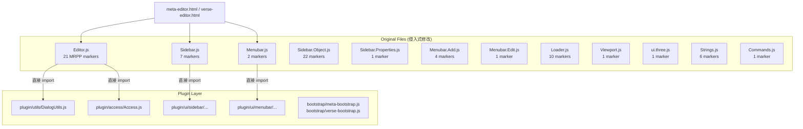
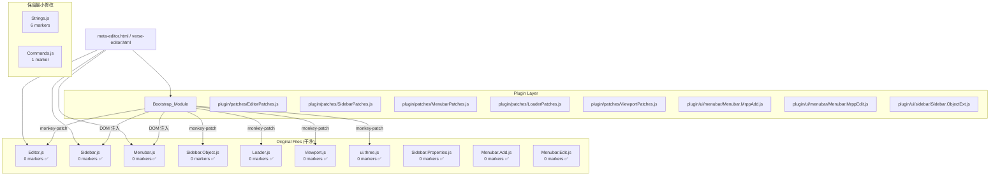
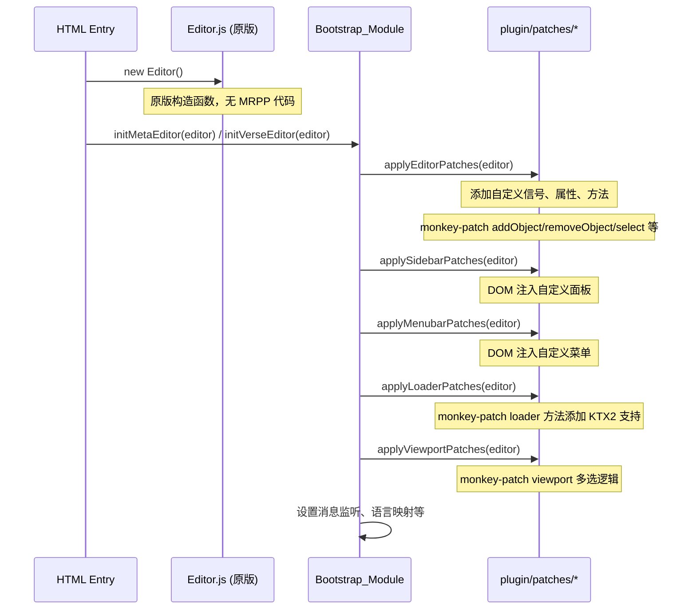

# 设计文档：Three.js 升级前期重构准备

## 概述

本设计文档描述如何将 12 个 three.js editor 原版文件中的 77 处侵入式 MRPP 修改（`// --- MRPP MODIFICATION START/END ---`）外部化到 `plugin/` 层，使原版文件可在 three.js 升级时直接替换或仅需最小合并。

核心策略：
- **Monkey-patch**：在 Bootstrap_Module 中运行时替换/扩展 Editor 对象的方法和属性
- **信号监听**：利用 editor.signals 事件系统在外部响应编辑器状态变化
- **DOM 操作**：在 Bootstrap_Module 中通过 DOM API 动态注入 UI 元素（菜单项、面板等）
- **独立模块**：将复杂的 MRPP 逻辑封装为 `plugin/` 下的独立模块

目标：从 77 处标记降至 20 处以内（Strings.js 保留 6 处，Commands.js 保留 1 处，其余文件目标 0 处）。

## 架构

### 当前架构



### 目标架构



### 初始化时序



### 设计决策与理由

1. **Monkey-patch 而非继承/包装**：Editor 是函数构造器 + prototype，不是 class。monkey-patch 最简单直接，且 HTML 入口文件已经创建了 Editor 实例后才调用 bootstrap，时序天然支持。

2. **DOM 操作注入 UI**：Sidebar/Menubar 等 UI 组件返回 DOM 容器，bootstrap 在它们构建完成后通过 DOM API 插入额外元素。这避免了修改原版文件。

3. **Strings.js 和 Commands.js 保持现状**：这两个文件的修改方式（spread 合并 + re-export）已经是最小侵入，升级时只需重新添加几行，不值得引入更复杂的运行时注册机制。

4. **patch 模块集中在 `plugin/patches/`**：将所有 monkey-patch 逻辑集中到一个目录，便于维护和审查。每个 patch 文件对应一个或一组原版文件。


## 组件与接口

### 1. `plugin/patches/EditorPatches.js`

负责外部化 Editor.js 中的所有 MRPP 修改。

```javascript
// 接口
export function applyEditorPatches(editor) { ... }
```

职责：
- 向 `editor.signals` 添加 20 个自定义信号（upload, release, savingStarted, savingFinished, objectsChanged, componentAdded/Changed/Removed, eventAdded/Changed/Removed, commandAdded/Changed/Removed, showGroundChanged, messageSend, messageReceive, notificationAdded, doneLoadObject, multipleObjectsTransformChanged）
- 向 `editor` 添加自定义属性（type, resources, selectedObjects, access, multiSelectGroup, data）
- 向 `editor` 添加自定义方法（save, showNotification, showConfirmation, getSelectedObjects, clearSelection）
- Monkey-patch `editor.addObject`：添加 commands 初始化、parent/index 参数支持、资源同步
- Monkey-patch `editor.removeObject`：添加 selectedObjects 清理
- Monkey-patch `editor.select`：添加 multiSelect 支持
- Monkey-patch `editor.clear`：添加 selectedObjects 清空
- Monkey-patch `editor.setScene`：添加 commands 初始化遍历
- Monkey-patch `editor.fromJSON`：添加 resources 保存
- Monkey-patch `editor.toJSON`：添加 resources 字段
- 执行语言映射逻辑（URL 参数 → config.setKey）

### 2. `plugin/patches/SidebarPatches.js`

负责外部化 Sidebar.js 和 Sidebar.Properties.js 的 MRPP 修改。

```javascript
// 接口
export function applySidebarPatches(editor, sidebarContainer) { ... }
export function applySidebarPropertiesPatches(editor, propertiesContainer) { ... }
```

职责：
- 在 Sidebar 构建完成后，通过 DOM 操作添加 Events、Screenshot 等面板标签
- 动态设置层级标签（getHierarchyLabel 逻辑）
- 在 Sidebar.Properties 构建完成后，通过信号监听动态切换面板（MultipleObjects、Component、Command、Text、Animation）

### 3. `plugin/patches/MenubarPatches.js`

负责外部化 Menubar.js、Menubar.Add.js、Menubar.Edit.js 的 MRPP 修改。

```javascript
// 接口
export function applyMenubarPatches(editor, menubarContainer) { ... }
```

职责：
- 在 Menubar 构建完成后，通过 DOM 操作添加 Screenshot/Scene、Goto 菜单
- 在 Menubar.Add 构建完成后，注入 MRPP 资源菜单项
- 在 Menubar.Edit 构建完成后，注入克隆/替换/删除/复制粘贴逻辑

### 4. `plugin/ui/menubar/Menubar.MrppAdd.js`

封装 Menubar.Add.js 中所有 MRPP 资源菜单逻辑。

```javascript
// 接口
export function injectMrppAddMenu(editor, addMenuOptions) { ... }
```

职责：
- Meta 模式：创建 entity/text/资源类型菜单项、loadResource/loadPhototype、messageReceive 处理
- Verse 模式：创建 meta 菜单项、add-module 消息处理
- 管理 window.resources 全局资源映射

### 5. `plugin/ui/menubar/Menubar.MrppEdit.js`

封装 Menubar.Edit.js 中所有 MRPP 编辑逻辑。

```javascript
// 接口
export function injectMrppEditMenu(editor, editMenuOptions) { ... }
```

职责：
- 多选克隆（含 components/commands 复制和 UUID 重生成）
- 资源替换（replace-resource 消息处理）
- 多选删除
- Ctrl+C/V 复制粘贴
- Del/Backspace 键盘快捷键

### 6. `plugin/ui/sidebar/Sidebar.ObjectExt.js`

封装 Sidebar.Object.js 中所有 MRPP 扩展逻辑。

```javascript
// 接口
export function injectSidebarObjectExtensions(editor, sidebarObjectContainer) { ... }
```

职责：
- 变换数据复制粘贴 UI（位置/旋转/缩放的 copy/paste 按钮）
- 重置位置/旋转/缩放按钮
- 悬停边框效果
- 媒体 loop 控制
- sortingOrder 选择器
- 对象类型本地化（getLocalizedObjectType）
- 编辑实体按钮
- Access 权限检查

### 7. `plugin/patches/LoaderPatches.js`

负责外部化 Loader.js 中的 KTX2 扩展。

```javascript
// 接口
export function applyLoaderPatches(editor) { ... }
```

职责：
- Monkey-patch `editor.loader.loadFiles`：在加载含 ktx2/glb/gltf 文件时初始化 KTX2Loader
- Monkey-patch `editor.loader.loadFile`：在 glb/gltf case 中设置 KTX2Loader
- 封装 ensureKTX2 懒初始化逻辑

### 8. `plugin/patches/ViewportPatches.js`

负责外部化 Viewport.js 中的多选变换逻辑。

```javascript
// 接口
export function applyViewportPatches(editor) { ... }
```

职责：
- 注入 MultiTransformCommand 使用逻辑
- multiSelectGroup 管理
- 多选包围盒计算
- 通过信号监听方式注入，而非直接修改 Viewport.js

### 9. `plugin/patches/UIThreePatches.js`

负责外部化 ui.three.js 中的 MoveMultipleObjectsCommand 导入。

```javascript
// 接口
export function applyUIThreePatches(editor) { ... }
```

职责：
- Monkey-patch UIOutliner 的拖拽处理逻辑，注入 MoveMultipleObjectsCommand

### Bootstrap_Module 修改

`meta-bootstrap.js` 和 `verse-bootstrap.js` 将在初始化函数开头调用所有 patch 函数：

```javascript
import { applyEditorPatches } from '../patches/EditorPatches.js';
import { applyLoaderPatches } from '../patches/LoaderPatches.js';
// ... 其他 patches

function initMetaEditor(editor) {
    // 先应用所有 patches
    applyEditorPatches(editor);
    applyLoaderPatches(editor);
    // ... 其他 patches
    
    // 然后执行现有的 bootstrap 逻辑
    editor.type = 'meta';
    // ...
}
```

## 数据模型

本次重构不引入新的数据模型。所有数据结构保持不变：

### 现有数据结构（保持不变）

| 数据结构 | 位置 | 说明 |
|---------|------|------|
| `editor.signals` | Editor 实例 | Signal 对象集合，MRPP 信号将通过 patch 动态添加 |
| `editor.selectedObjects` | Editor 实例 | 多选对象数组，通过 patch 动态添加 |
| `editor.resources` | Editor 实例 | 场景资源信息数组，通过 patch 动态添加 |
| `editor.data` | Editor 实例 | 编辑器数据对象（含 user、resources），通过 patch 动态添加 |
| `window.resources` | 全局 | 资源 Map，由 Menubar.MrppAdd 管理 |
| `object.components` | THREE.Object3D | 对象组件数组，由 MRPP 业务逻辑管理 |
| `object.commands` | THREE.Object3D | 对象命令数组，由 MRPP 业务逻辑管理 |
| `object.userData` | THREE.Object3D | 对象自定义数据，含 type/resource/sortingOrder/loop 等 |

### Monkey-patch 模式

所有 monkey-patch 遵循统一模式：

```javascript
// 保存原始方法引用
const originalMethod = editor.methodName.bind(editor);

// 替换为扩展版本
editor.methodName = function(...args) {
    // 前置 MRPP 逻辑
    // ...
    
    // 调用原始方法
    const result = originalMethod(...args);
    
    // 后置 MRPP 逻辑
    // ...
    
    return result;
};
```

对于 prototype 方法（如 addObject），需要特别处理：

```javascript
const originalAddObject = Editor.prototype.addObject;

Editor.prototype.addObject = function(object, parent, index) {
    // 前置 MRPP 逻辑：初始化 commands
    if (object.commands === undefined) {
        object.commands = [];
    }
    
    // 调用原始方法（原版不支持 parent/index，需要完全替换）
    // ...
};
```


## 正确性属性

*属性是一种在系统所有有效执行中都应成立的特征或行为——本质上是关于系统应该做什么的形式化陈述。属性是人类可读规范与机器可验证正确性保证之间的桥梁。*

### Property 1: MRPP 标记数量合规

*对于任意* 12 个原版文件中的任一文件，该文件中的 MRPP 修改标记（`// --- MRPP MODIFICATION START ---`）数量应当不超过该文件的目标上限。具体目标：Sidebar.js=0, Menubar.js=0, Sidebar.Properties.js=0, Menubar.Edit.js=0, Menubar.Add.js=0, Loader.js=0, Viewport.js=0, ui.three.js=0, Editor.js≤2, Sidebar.Object.js≤5, Strings.js=6, Commands.js=1。总计不超过 20。

**Validates: Requirements 1.4, 2.2, 2.3, 3.8, 4.3, 4.4, 5.2, 5.3, 6.2, 6.3, 7.3, 7.4, 8.3, 8.4, 9.3, 9.4, 10.3, 10.4, 11.2, 12.2, 13.2, 14.2, 14.3, 16.1, 16.2, 16.3, 16.4**

### Property 2: 目标零标记文件无 plugin 导入

*对于任意* 目标零标记的原版文件（Sidebar.js, Menubar.js, Sidebar.Properties.js, Menubar.Edit.js, Menubar.Add.js, Loader.js, Viewport.js, ui.three.js），该文件中的所有 import 语句都不应引用 `plugin/` 目录路径。

**Validates: Requirements 4.3, 5.2, 6.2, 7.3, 8.3, 9.3, 10.3, 13.2, 14.2**

### Property 3: MRPP 扩展注册完整性

*对于任意* MRPP 自定义扩展名称（包括 20 个信号名、5 个属性名、5 个方法名），在 Bootstrap_Module 调用 applyEditorPatches 之后，该名称应当存在于 editor 对象（或 editor.signals）上，且类型正确（信号为 Signal 实例，方法为 function）。

**Validates: Requirements 1.1, 1.2, 1.3**

### Property 4: 语言映射正确性

*对于任意* 支持的语言代码映射对（zh-CN→zh-cn, en-US→en-us, ja-JP→ja-jp, zh-TW→zh-tw, th-TH→th-th），语言映射函数应当将输入代码正确映射为输出代码。对于不在映射表中的任意字符串，映射函数不应修改 config。

**Validates: Requirements 2.1**

### Property 5: import 路径有效性（扩展现有测试）

*对于任意* `plugin/` 和 `three.js/editor/js/` 目录下的 JavaScript 文件中的任意相对 import 路径，该路径应当解析到一个存在的文件。这包括新增的 `plugin/patches/` 目录下的文件。

**Validates: Requirements 17.1**

### Property 6: i18n 字符串完整性（现有测试）

*对于任意* MRPP 字符串键和任意支持的语言（en-us, zh-cn, ja-jp, zh-tw, th-th），合并后的 Strings 模块应当包含该键且值与 mrppStrings 源一致。

**Validates: Requirements 17.2**

### Property 7: three.js 引用规范（现有测试）

*对于任意* `plugin/` 目录下的 JavaScript 文件中的 three.js 引用，应当使用 bare specifier（`'three'`）而非相对路径。

**Validates: Requirements 17.3**

### Property 8: 无 TypeScript 文件（现有测试）

*对于任意* `plugin/` 目录下的文件，其扩展名不应为 `.ts` 或 `.tsx`。

**Validates: Requirements 17.4**

## 错误处理

### Monkey-patch 安全性

所有 monkey-patch 操作应遵循防御性编程原则：

1. **原始方法保存**：在替换前始终保存原始方法引用，确保可以回退
2. **参数透传**：扩展方法应正确透传所有参数给原始方法
3. **异常隔离**：MRPP 扩展逻辑中的异常不应阻止原始方法的执行

```javascript
// 示例：安全的 monkey-patch 模式
const original = editor.someMethod;
editor.someMethod = function(...args) {
    try {
        // MRPP 前置逻辑
    } catch (e) {
        console.warn('MRPP extension error:', e);
    }
    
    const result = original.apply(this, args);
    
    try {
        // MRPP 后置逻辑
    } catch (e) {
        console.warn('MRPP extension error:', e);
    }
    
    return result;
};
```

### DOM 注入安全性

DOM 操作注入 UI 元素时：

1. **元素存在性检查**：注入前检查目标容器是否存在
2. **重复注入防护**：使用唯一 ID 或 class 标记已注入的元素，避免重复注入
3. **时序保证**：确保在目标 UI 组件构建完成后再执行注入

### 信号注册安全性

向 editor.signals 添加自定义信号时：

1. **冲突检测**：检查信号名是否已存在，避免覆盖原版信号
2. **类型验证**：确保添加的是 Signal 实例

## 测试策略

### 双重测试方法

本项目采用单元测试 + 属性测试的双重策略：

- **属性测试**：验证跨所有输入的通用属性（使用 fast-check 库）
- **单元测试**：验证特定示例、边界情况和错误条件（使用 vitest）

### 属性测试配置

- 测试框架：vitest
- 属性测试库：fast-check（项目已在使用）
- 每个属性测试最少运行 100 次迭代
- 每个测试用注释标注对应的设计属性
- 标注格式：**Feature: threejs-upgrade-prep-refactor, Property {number}: {property_text}**
- 每个正确性属性由一个属性测试实现

### 测试文件组织

```
three.js/editor/test/properties/
├── import-paths.test.js          (现有 - Property 5)
├── i18n-completeness.test.js     (现有 - Property 6)
├── three-reference.test.js       (现有 - Property 7)
├── no-typescript.test.js         (现有 - Property 8)
├── mrpp-marker-count.test.js     (新增 - Property 1)
├── no-plugin-imports.test.js     (新增 - Property 2)
├── editor-extensions.test.js     (新增 - Property 3)
└── language-mapping.test.js      (新增 - Property 4)
```

### 单元测试覆盖

单元测试应覆盖以下关键场景：

1. **EditorPatches**：验证每个 monkey-patch 方法的具体行为（addObject 的 parent/index 参数、select 的 multiSelect 模式等）
2. **新增 plugin 模块**：验证 Menubar.MrppAdd、Menubar.MrppEdit、Sidebar.ObjectExt 等模块的文件存在性
3. **边界情况**：空 selectedObjects 时的 clear、null 对象的 select、重复 patch 调用等

### 现有测试兼容性

4 个现有属性测试必须继续通过：
- `import-paths.test.js`：新增的 `plugin/patches/` 文件的 import 路径必须正确
- `i18n-completeness.test.js`：Strings.js 的 mrppStrings 合并不受影响
- `three-reference.test.js`：新增的 plugin 文件中的 three.js 引用使用 bare specifier
- `no-typescript.test.js`：新增文件均为 .js

