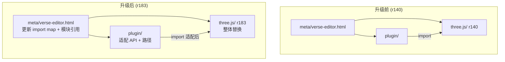
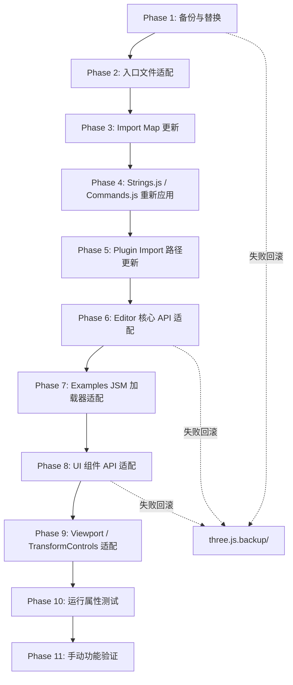

# 设计文档：Three.js 版本升级（r140 → r183）

## 概述

本设计文档描述将 `three.js/` 目录从 r140 整体替换为 r183 的升级策略，同时保持 `plugin/` 层所有 MRPP 功能正常运行。

### 核心挑战

跨越 43 个版本（r140→r183）意味着大量 Breaking Changes 需要适配。得益于前期重构（threejs-upgrade-prep-refactor），10 个 editor 文件已恢复为 r140 原版（0 MRPP 标记），所有 MRPP 逻辑已外部化到 `plugin/` 层。这使得升级策略变为：

1. **直接替换** `three.js/` 目录为 r183 完整仓库
2. **保留自定义入口文件** `meta-editor.html` 和 `verse-editor.html`
3. **适配 Plugin_Layer** 中的 import 路径和 API 调用
4. **重新应用** Strings.js 和 Commands.js 的最小 MRPP 修改

### 设计决策与理由

1. **整体替换而非增量合并**：由于 editor 原版文件已干净（0 MRPP 标记），无需逐文件 diff 合并，直接替换 `three.js/` 目录最简单可靠。

2. **Plugin_Layer 适配优先于 Editor 修改**：所有 MRPP 逻辑已在 `plugin/` 中，升级后只需调整 plugin 代码适配新 API，不需要修改 r183 editor 原版文件（Strings.js 和 Commands.js 除外）。

3. **保持无构建工具约束**：r183 editor 仍支持纯 ES modules + import map 运行，无需引入构建工具。如果 r183 editor 的某些功能依赖构建步骤，使用其预构建产物。

4. **渐进式验证**：每完成一个适配阶段就运行属性测试，确保不引入回归。

## 架构

### 升级前后对比



### 升级执行流程




### r140 → r183 关键 Breaking Changes 研究

基于 three.js 官方 migration guide 和 changelog，以下是影响本项目的主要变更：

#### Import Map 与模块结构变更

| 版本 | 变更 | 影响 |
|------|------|------|
| r150+ | import map 新增 `"three/addons/"` 映射到 `examples/jsm/` | 入口文件需添加此条目 |
| r160+ | editor 入口文件结构可能变化（新增模块、初始化顺序） | 自定义入口文件需对齐 |
| r183 | `three.module.js` 构建产物路径可能变化 | import map 中 `"three"` 映射需验证 |

#### 核心 API 变更

| 版本 | 变更 | 影响的 Plugin 文件 |
|------|------|-------------------|
| r150 | `renderer.physicallyCorrectLights` → `renderer.useLegacyLights` | MetaFactory.js（如有引用） |
| r155 | `renderer.useLegacyLights` 废弃，改用 `renderer.useLegacyLights = false` 默认 | 同上 |
| r160+ | `renderer.outputEncoding` → `renderer.outputColorSpace` | ViewportPatches.js |
| r150+ | `material.encoding` → `material.colorSpace` | MetaFactory.js 材质处理 |
| r152 | `THREE.DefaultLoadingManager` 仍可用但推荐使用实例化 manager | MetaFactory.js, LoaderPatches.js |
| r141+ | `Object3D.traverse` 行为不变，但回调中 `this` 绑定可能变化 | EditorPatches.js, ViewportPatches.js |

#### Editor 内部 API 变更

| 版本 | 变更 | 影响 |
|------|------|------|
| r150+ | Editor 构造函数可能从函数式改为 class 语法 | EditorPatches.js monkey-patch 方式 |
| r160+ | Signals 系统可能被替换为 EventDispatcher 或自定义事件 | 所有 Patches 文件的信号注册 |
| r170+ | UI 组件库（ui.js）API 可能变化 | UIThreePatches.js, SidebarPatches.js |
| r183 | Editor.addObject/removeObject/select 方法签名可能变化 | EditorPatches.js 所有 monkey-patch |

#### Examples JSM 加载器变更

| 版本 | 变更 | 影响 |
|------|------|------|
| r148+ | GLTFLoader API 基本稳定 | MetaFactory.js |
| r150+ | DRACOLoader.setDecoderPath 路径可能变化 | MetaFactory.js, LoaderPatches.js |
| r155+ | KTX2Loader.detectSupport API 可能变化 | MetaFactory.js, LoaderPatches.js |
| r160+ | VOXLoader 可能被移除或路径变更 | MetaFactory.js |
| r170+ | `examples/jsm/loaders/` 路径结构可能重组 | 所有加载器 import |

#### Draco / Basis Transcoder 变更

| 版本 | 变更 | 影响 |
|------|------|------|
| r150+ | Draco 解码器文件路径可能从 `examples/js/libs/draco/` 变更 | 入口文件 script 标签、DRACOLoader 配置 |
| r160+ | Basis transcoder 文件可能更新版本 | `editor/basis/` 目录、KTX2Loader 配置 |

## 组件与接口

### 1. 仓库替换模块

负责将 `three.js/` 目录从 r140 替换为 r183。

**操作步骤：**
```bash
# 备份
mv three.js three.js.backup

# 克隆 r183
git clone --branch r183 --depth 1 https://github.com/mrdoob/three.js.git

# 恢复自定义入口文件
cp three.js.backup/editor/meta-editor.html three.js/editor/
cp three.js.backup/editor/verse-editor.html three.js/editor/
```

**约束：**
- 不修改 r183 原版文件（Strings.js 和 Commands.js 除外）
- 保留 `editor/basis/` 目录（如 r183 包含则使用 r183 版本）

### 2. 入口文件适配模块

负责更新 `meta-editor.html` 和 `verse-editor.html` 以匹配 r183 editor 结构。

**需要对比的内容：**
- r183 原版 `editor/index.html` 的 `<script>` 标签列表（codemirror、acorn、tern、signals 等）
- r183 原版 `editor/index.html` 的 import map 配置
- r183 原版 `editor/index.html` 的 ES module 导入列表
- r183 原版 `editor/index.html` 的初始化逻辑

**适配策略：**
以 r183 原版 `editor/index.html` 为基准，在其基础上添加：
- Bootstrap 模块导入（`import { initMetaEditor } from '../../plugin/bootstrap/meta-bootstrap.js'`）
- `initMetaEditor(editor)` / `initVerseEditor(editor)` 调用
- 保留 MRPP 特有的 `<script>` 标签（如 ffmpeg）

### 3. Import Map 更新模块

**当前 import map（r140）：**
```json
{
  "imports": {
    "three": "../build/three.module.js"
  }
}
```

**预期 r183 import map：**
```json
{
  "imports": {
    "three": "../build/three.module.js",
    "three/addons/": "../examples/jsm/"
  }
}
```

`"three/addons/"` 条目允许 `import { GLTFLoader } from 'three/addons/loaders/GLTFLoader.js'` 语法。但由于 Plugin_Layer 当前使用相对路径引用 examples/jsm/，短期内不强制迁移到 addons 语法。

### 4. Strings.js MRPP 修改重新应用

**需要在 r183 Strings.js 中添加的内容：**

文件顶部：
```javascript
// --- MRPP MODIFICATION START ---
import { mrppStrings } from '../../../plugin/i18n/MrppStrings.js';
// --- MRPP MODIFICATION END ---
```

每个语言对象末尾：
```javascript
// --- MRPP MODIFICATION START ---
...mrppStrings["xx-xx"],
// --- MRPP MODIFICATION END ---
```

**适配要点：**
- r183 Strings.js 可能新增/移除/重命名语言代码
- r183 Strings.js 可能改变对象结构（如从函数改为 class）
- 需要确认 r183 支持的语言列表，确保 mrppStrings 的 5 个语言（en-us, zh-cn, ja-jp, zh-tw, th-th）都有对应的语言对象

### 5. Commands.js MRPP 修改重新应用

**需要在 r183 Commands.js 末尾添加的内容：**
```javascript
// --- MRPP MODIFICATION START ---
export { AddComponentCommand } from '../../../../plugin/commands/AddComponentCommand.js';
export { RemoveComponentCommand } from '../../../../plugin/commands/RemoveComponentCommand.js';
export { SetComponentValueCommand } from '../../../../plugin/commands/SetComponentValueCommand.js';
export { AddCommandCommand } from '../../../../plugin/commands/AddCommandCommand.js';
export { RemoveCommandCommand } from '../../../../plugin/commands/RemoveCommandCommand.js';
export { SetCommandValueCommand } from '../../../../plugin/commands/SetCommandValueCommand.js';
export { AddEventCommand } from '../../../../plugin/commands/AddEventCommand.js';
export { RemoveEventCommand } from '../../../../plugin/commands/RemoveEventCommand.js';
export { SetEventValueCommand } from '../../../../plugin/commands/SetEventValueCommand.js';
export { MoveMultipleObjectsCommand } from '../../../../plugin/commands/MoveMultipleObjectsCommand.js';
export { MultiTransformCommand } from '../../../../plugin/commands/MultiTransformCommand.js';
// --- MRPP MODIFICATION END ---
```

**适配要点：**
- r183 Commands.js 的目录位置可能变化（影响 `../../../../` 相对路径层级）
- r183 Commands.js 可能改变导出方式（如从 re-export 改为集中导出对象）
- 需要验证 r183 Commands.js 中原版命令列表是否有增减

### 6. Plugin Import 路径适配模块

**受影响的 import 类别：**

| 类别 | 当前路径模式 | 可能的 r183 变化 |
|------|-------------|-----------------|
| three.js 核心 | `import * as THREE from 'three'` | 不变（bare specifier） |
| Examples JSM 加载器 | `../../three.js/examples/jsm/loaders/GLTFLoader.js` | 路径可能变化 |
| Editor JS 模块 | `../../three.js/editor/js/Editor.js` | 文件可能重命名/移动 |
| Editor Commands | `../../three.js/editor/js/commands/MoveObjectCommand.js` | 同上 |
| Editor UI 库 | `../../three.js/editor/js/libs/ui.three.js` | 同上 |

**受影响的 Plugin 文件清单：**

| Plugin 文件 | 引用的 three.js 路径 |
|------------|---------------------|
| `plugin/mrpp/MetaFactory.js` | `GLTFLoader.js`, `DRACOLoader.js`, `VOXLoader.js`, `KTX2Loader.js` |
| `plugin/mrpp/VerseFactory.js` | `GLTFLoader.js`, `DRACOLoader.js` |
| `plugin/patches/LoaderPatches.js` | `KTX2Loader.js` |
| `plugin/patches/UIThreePatches.js` | `MoveObjectCommand.js`, `ui.three.js` |
| `plugin/ui/sidebar/Sidebar.ObjectExt.js` | Editor UI 模块 |
| `plugin/ui/menubar/Menubar.MrppEdit.js` | Editor Commands |

### 7. Editor 核心 API 适配模块

**EditorPatches.js 适配清单：**

| Monkey-patch 目标 | 适配策略 |
|------------------|---------|
| `editor.signals` 添加自定义信号 | 检查 r183 是否仍使用 js-signals；如改用 EventDispatcher，需要适配信号注册方式 |
| `editor.addObject` | 检查 r183 方法签名；如改为 class 方法，需调整 monkey-patch 方式 |
| `editor.removeObject` | 同上 |
| `editor.select` | 同上 |
| `editor.clear` | 同上 |
| `editor.setScene` | 同上 |
| `editor.fromJSON` / `editor.toJSON` | 检查 r183 是否改为 async 或返回值变化 |

**关键判断点：**
- 如果 r183 Editor 仍使用 `signals.Signal`（js-signals 库），则 `registerCustomSignals` 无需修改
- 如果 r183 Editor 改用 `EventDispatcher`，则需要将所有 `new Signal()` 改为 `addEventListener/dispatchEvent` 模式，同时更新所有 `.add()` 调用为 `.addEventListener()`
- 如果 r183 Editor 从函数构造器改为 class，monkey-patch 仍然有效（class 实例的方法可以被覆盖）

### 8. Viewport / TransformControls 适配模块

**ViewportPatches.js 适配清单：**

| 功能 | 适配策略 |
|------|---------|
| `editor.sceneHelpers.add(multiSelectGroup)` | 检查 r183 是否仍有 sceneHelpers |
| `transformControls.getMode()` | 检查 r183 TransformControls API |
| `transformControls.object` | 同上 |
| `signals.refreshSidebarObject3D` | 检查 r183 是否仍有此信号 |

### 9. UIOutliner 适配模块

**UIThreePatches.js 适配清单：**

| 功能 | 适配策略 |
|------|---------|
| `UIOutliner.prototype` 扩展 | 检查 r183 UIOutliner 是否仍存在且为 prototype-based |
| `UIOutliner` 的 `options` 数组结构 | 检查 r183 是否改变了 option 元素结构 |
| `MoveObjectCommand` import 路径 | 更新为 r183 路径 |


## 数据模型

本次升级不引入新的数据模型。所有现有数据结构保持不变：

| 数据结构 | 位置 | 升级影响 |
|---------|------|---------|
| `editor.signals` | Editor 实例 | 如 r183 改用 EventDispatcher，信号注册方式需适配 |
| `editor.selectedObjects` | Editor 实例（由 patch 添加） | 不受影响（plugin 层管理） |
| `editor.resources` | Editor 实例（由 patch 添加） | 不受影响 |
| `editor.data` | Editor 实例（由 patch 添加） | 不受影响 |
| `window.resources` | 全局 | 不受影响 |
| `object.components` / `object.commands` | THREE.Object3D 实例 | 不受影响（动态属性） |
| `object.userData` | THREE.Object3D 实例 | r183 Object3D.userData 仍为普通对象 |

### Import Map 数据模型变更

**r140 import map：**
```json
{ "imports": { "three": "../build/three.module.js" } }
```

**r183 import map（预期）：**
```json
{
  "imports": {
    "three": "../build/three.module.js",
    "three/addons/": "../examples/jsm/"
  }
}
```

### Strings.js 数据模型

r183 Strings.js 可能新增语言键或移除旧键。MRPP 字符串通过 spread 运算符合并，不会与原版键冲突（MRPP 键使用独立命名空间如 `sidebar/events`、`sidebar/screenshot` 等）。

如果 r183 改变了语言代码格式（如 `en-us` → `en`），需要同步更新 `MrppStrings.js` 的键名和 `EditorPatches.js` 的 `LANGUAGE_MAPPING`。


## 正确性属性

*属性是一种在系统所有有效执行中都应成立的特征或行为——本质上是关于系统应该做什么的形式化陈述。属性是人类可读规范与机器可验证正确性保证之间的桥梁。*

### Property 1: Import 路径有效性（扩展现有测试）

*对于任意* `plugin/` 和 `three.js/editor/js/` 目录下的 JavaScript 文件中的任意相对 import 路径，该路径应当解析到一个存在的文件。

**Validates: Requirements 4.1, 4.2, 4.3, 4.4, 4.5, 6.5, 10.1, 10.2, 12.1, 12.2, 12.3, 12.4, 13.1**

### Property 2: i18n 字符串完整性（现有测试）

*对于任意* MRPP 字符串键和任意支持的语言（en-us, zh-cn, ja-jp, zh-tw, th-th），合并后的 Strings 模块应当包含该键且值与 mrppStrings 源一致。

**Validates: Requirements 6.1, 13.2**

### Property 3: three.js 引用规范（现有测试）

*对于任意* `plugin/` 目录下的 JavaScript 文件中的 three.js 核心库引用，应当使用 bare specifier（`'three'`）而非相对路径。

**Validates: Requirements 2.3, 13.3**

### Property 4: 无 TypeScript 文件（现有测试）

*对于任意* `plugin/` 目录下的文件，其扩展名不应为 `.ts` 或 `.tsx`。

**Validates: Requirements 13.4, 16.2**

### Property 5: Commands.js MRPP 命令 re-export 完整性

*对于任意* 11 个 MRPP 命令名称（AddComponentCommand、RemoveComponentCommand、SetComponentValueCommand、AddCommandCommand、RemoveCommandCommand、SetCommandValueCommand、AddEventCommand、RemoveEventCommand、SetEventValueCommand、MoveMultipleObjectsCommand、MultiTransformCommand），Commands.js 文件应当包含该命令的 export 语句，且 import 路径指向 `plugin/commands/` 目录下存在的文件。

**Validates: Requirements 6.2, 6.5**

### Property 6: Plugin 层无已废弃 three.js API 使用

*对于任意* `plugin/` 目录下的 JavaScript 文件，该文件不应包含已知在 r183 中被移除或重命名的 three.js API 调用（如 `renderer.gammaOutput`、`renderer.gammaFactor`、`material.encoding`、`renderer.outputEncoding`、`Geometry` 构造函数等）。

**Validates: Requirements 7.4, 7.6**

### Property 7: 入口文件 Import Map 正确性

*对于任意* 自定义入口文件（meta-editor.html、verse-editor.html），其 import map JSON 应当包含 `"three"` 映射条目，且映射目标文件存在于文件系统中。

**Validates: Requirements 2.1, 2.4**

### Property 8: 入口文件资源引用有效性

*对于任意* 自定义入口文件（meta-editor.html、verse-editor.html）中的 `<script src="...">` 标签和 ES module `import ... from '...'` 语句，引用的文件路径应当解析到存在的文件（外部 URL 除外）。

**Validates: Requirements 10.1, 10.2, 10.4**

### Property 9: 无构建工具配置文件

*对于任意* 项目根目录下的文件，不应存在构建工具配置文件（webpack.config.js、vite.config.js、vite.config.ts、rollup.config.js、rollup.config.mjs、tsconfig.json）。

**Validates: Requirements 16.1**


## 错误处理

### 升级过程中的错误处理

#### 仓库替换失败

- **备份恢复**：如果 r183 克隆或替换过程中出错，从 `three.js.backup/` 恢复
- **验证步骤**：替换后立即检查关键文件存在性（`build/three.module.js`、`editor/js/Editor.js`、`examples/jsm/loaders/GLTFLoader.js`）

#### Import 路径解析失败

- **检测方式**：运行 import-paths 属性测试，失败时输出具体的断裂路径
- **修复策略**：根据 r183 目录结构更新对应的 import 路径
- **批量更新**：使用 grep 查找所有引用旧路径的文件，统一更新

#### API 不兼容

- **检测方式**：浏览器控制台报错（TypeError、ReferenceError）
- **修复策略**：
  1. 查阅 three.js migration guide 确认替代 API
  2. 更新 plugin 文件中的 API 调用
  3. 如果替代 API 不存在，在 plugin 层提供 polyfill

#### Signals 系统不兼容

- **检测方式**：`editor.signals.xxx is not a function` 或 `Signal is not defined`
- **修复策略**：
  1. 如果 r183 仍使用 js-signals：无需修改
  2. 如果 r183 改用 EventDispatcher：创建适配层，将 Signal API 映射到 EventDispatcher API
  3. 如果 r183 完全移除事件系统：自行引入 js-signals 库到入口文件

#### Monkey-patch 目标方法不存在

- **检测方式**：`Cannot read property 'bind' of undefined`
- **修复策略**：
  1. 检查 r183 Editor 是否重命名了该方法
  2. 如果方法被移除，在 patch 中提供完整实现而非 monkey-patch
  3. 如果方法签名变化，适配新签名

### Plugin 层运行时错误处理

所有 monkey-patch 已遵循 try/catch 隔离模式（在前期重构中建立），确保 MRPP 扩展逻辑的异常不会阻止原始方法执行。此模式在升级后继续有效。

## 测试策略

### 双重测试方法

本项目采用单元测试 + 属性测试的双重策略：

- **属性测试**：验证跨所有输入的通用属性（使用 fast-check 库）
- **单元测试**：验证特定示例、边界情况和错误条件（使用 vitest）

### 属性测试配置

- 测试框架：vitest
- 属性测试库：fast-check（项目已在使用）
- 每个属性测试最少运行 100 次迭代
- 每个测试用注释标注对应的设计属性
- 标注格式：**Feature: threejs-version-upgrade, Property {number}: {property_text}**
- 每个正确性属性由一个属性测试实现

### 测试文件组织

```
three.js/editor/test/properties/
├── import-paths.test.js              (现有 - Property 1，可能需要更新 KNOWN_BROKEN_IMPORTS)
├── i18n-completeness.test.js         (现有 - Property 2)
├── three-reference.test.js           (现有 - Property 3)
├── no-typescript.test.js             (现有 - Property 4)
├── commands-reexport.test.js         (新增 - Property 5)
├── deprecated-api.test.js            (新增 - Property 6)
├── import-map.test.js                (新增 - Property 7)
├── entry-file-references.test.js     (新增 - Property 8)
└── no-build-tools.test.js            (新增 - Property 9)
```

### 现有测试适配

4 个现有属性测试在升级后必须继续通过：

| 测试文件 | 可能需要的调整 |
|---------|--------------|
| `import-paths.test.js` | 更新 `KNOWN_BROKEN_IMPORTS` 集合（如有新的已知断裂路径） |
| `i18n-completeness.test.js` | 如 r183 Strings.js 结构变化，更新解析逻辑 |
| `three-reference.test.js` | 无需调整 |
| `no-typescript.test.js` | 无需调整 |

### 新增属性测试说明

#### Property 5: Commands.js MRPP 命令 re-export 完整性
- 读取 `three.js/editor/js/commands/Commands.js` 文件内容
- 对 11 个 MRPP 命令名称，检查文件中包含对应的 `export { XxxCommand }` 语句
- 检查每个 export 的 import 路径指向存在的文件

#### Property 6: Plugin 层无已废弃 API
- 扫描 `plugin/` 下所有 JS 文件
- 检查不包含已知废弃 API 模式（正则匹配）
- 废弃 API 列表：`\.gammaOutput`, `\.gammaFactor`, `\.outputEncoding`, `new Geometry\(`, `\.encoding\s*=` 等

#### Property 7: Import Map 正确性
- 解析 `meta-editor.html` 和 `verse-editor.html` 中的 `<script type="importmap">` 内容
- 验证 JSON 包含 `"three"` 键
- 验证映射目标文件存在

#### Property 8: 入口文件资源引用有效性
- 解析入口文件中的 `<script src="...">` 和 `import ... from '...'`
- 过滤掉外部 URL（http/https）
- 验证本地路径解析到存在的文件

#### Property 9: 无构建工具配置
- 扫描项目根目录
- 验证不存在 webpack/vite/rollup/tsconfig 配置文件

### 单元测试覆盖

单元测试应覆盖以下关键场景：

1. **版本验证**：`three.module.js` 包含 r183 版本标识
2. **自定义入口文件存在性**：`meta-editor.html` 和 `verse-editor.html` 存在
3. **Basis/Draco 文件存在性**：transcoder 和 decoder 文件存在于预期路径
4. **Strings.js MRPP 标记**：文件包含 mrppStrings import 和 5 个语言的 spread

### 手动测试清单

以下功能需要在浏览器中手动验证：

1. Meta Editor 正常启动（`node server.js` → 访问 `meta-editor.html`）
2. Verse Editor 正常启动
3. 场景加载（含 GLTF/GLB 模型、Draco 压缩、KTX2 纹理）
4. 对象添加/删除/选择
5. 多选操作（Ctrl+Click、Shift+Click）
6. 多选变换（位置、旋转、缩放）+ Undo/Redo
7. Outliner 拖拽（单对象、多对象）
8. 组件/命令/事件管理
9. 截图功能
10. 保存/加载
11. 父窗口消息通信
